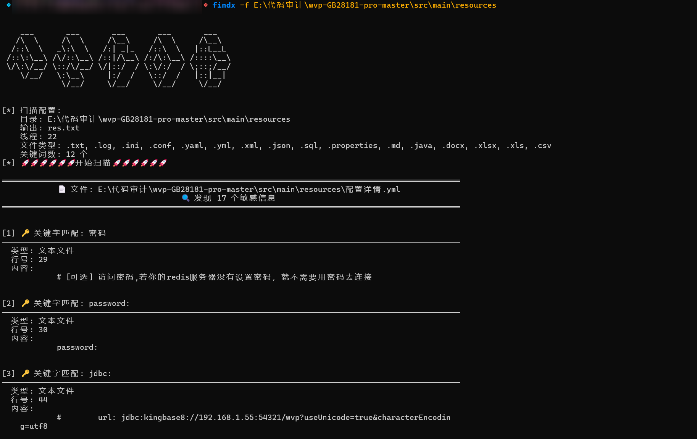
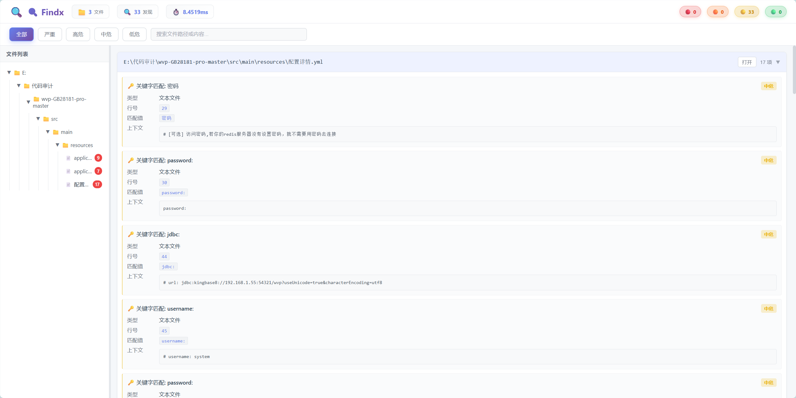

# Findx - 文件敏感信息扫描工具


**一个强大的文件敏感信息扫描工具，支持多种文件格式，包括文本、Office文档和二进制文件**

## 📖 简介

Findx 是一个用 Go 语言开发的高性能文件敏感信息扫描工具，专门用于在各类文件中查找可能包含敏感信息的内容，如密码、API密钥、数据库连接字符串等。该工具支持多种文件格式，包括文本文件、Office文档、CSV文件以及二进制文件（DLL、EXE等），并提供了美观的可视化HTML报告。

## ✨ 主要特性

- 🔍 **多格式支持**：支持文本、Word、Excel、CSV和二进制文件（PE文件）
- ⚡ **高性能并发**：充分利用多核CPU，支持自定义线程数
- 🎯 **智能检测**：内置多种敏感信息检测规则，支持自定义关键词
- 🛡️ **二进制分析**：独特的二进制文件分析能力，可从PE文件中提取敏感信息
- 📊 **可视化报告**：生成美观的HTML报告，便于结果分析和分享
- 🌐 **中英文支持**：完整的双语界面和文档
- 🔧 **灵活配置**：支持排除目录/文件、限制文件大小等高级选项

## 🚀 快速开始

### 安装

#### 从源码编译

```bash
git clone https://github.com/onewinner/Findx.git
cd Findx
go build -o findx cmd/findx/main.go
```

#### 从 Releases 下载

访问 [Releases 页面](https://github.com/onewinner/Findx/releases) 下载适合您系统的预编译版本。

### 基本使用

```bash
# 扫描当前目录
findx -f .

# 扫描指定目录
findx -f /path/to/scan

# 指定输出文件
findx -f /path/to/scan -o results.txt

# 生成HTML报告
findx -f /path/to/scan --html report.html
```



## 📖 详细使用说明

### 命令行参数

| 参数 | 长参数 | 描述 | 默认值 |
|------|--------|------|--------|
| `-f` | `--folder` | 扫描目录（必填） | - |
| `-o` | `--output` | 输出文件路径 | `res.txt` |
| `--html` | `--html-output` | HTML报告文件路径 | `输出文件名.html` |
| `-t` | `--type` | 指定文件类型（逗号分隔） | `.txt,.log,.ini,.conf,.yaml,.yml,.xml,.json,.sql,.properties,.md,.java,.docx,.xlsx,.xls,.csv` |
| `-ta` | `--type-append` | 追加文件类型（逗号分隔） | - |
| `-k` | `--keyword` | 搜索关键词（逗号分隔） | `password=,username=,jdbc:,user=,ssh-,ldap:,mysqli_connect,sk-,账号,密码,username:,password:` |
| `-ka` | `--keyword-append` | 追加关键词（逗号分隔） | - |
| `-n` | `--thread` | 线程数 | CPU核心数 |
| `--verbose` | `--vb` | 实时输出扫描结果 | `true` |
| `-s` | `--max-size` | 最大文件大小（MB，0表示不限制） | `0` |
| `-ed` | `--exclude-dir` | 排除目录（逗号分隔） | - |
| `-ef` | `--exclude-file` | 排除文件模式（逗号分隔） | - |
| `-b` | `--binary` | 启用二进制文件扫描模式 | `false` |
| `--ctx` | `--context` | 上下文长度（字符数） | `150` |

### 使用示例

#### 基本扫描
```bash
# 扫描当前目录
findx -f .

# 扫描指定目录
findx -f /path/to/project
```

#### 指定文件类型和关键词
```bash
# 只扫描Java和配置文件
findx -f /path/to/java-project -t .java,.properties,.xml

# 搜索特定关键词
findx -f /path/to/scan -k "password,token,api_key"

# 追加关键词到默认列表
findx -f /path/to/scan -ka "private_key,secret"
```

#### 高级选项
```bash
# 排除特定目录和文件
findx -f /path/to/scan -ed "node_modules,.git" -ef "*.min.js,*.tmp"

# 限制文件大小
findx -f /path/to/scan -s 10  # 限制为10MB

# 使用多线程加速
findx -f /path/to/scan -n 16
```

#### 二进制文件扫描
```bash
# 启用二进制扫描模式
findx -b -f /path/to/binaries

# 直接指定二进制文件类型
findx -t .dll,.exe -f /path/to/binaries

# 扫描二进制文件并自定义上下文长度
findx -b -f /path/to/binaries --ctx 200
```

#### 自定义输出
```bash
# 指定输出文件和HTML报告名称
findx -f /path/to/scan -o result.txt --html report.html

# 关闭实时输出
findx -f /path/to/scan --verbose=false
```

## 📊 支持的文件类型

### 文本文件
- `.txt`, `.log`, `.ini`, `.conf`, `.yaml`, `.yml`
- `.xml`, `.json`, `.sql`, `.properties`, `.md`
- 代码文件：`.java`, `.py`, `.js`, `.php`, `.go`, `.c`, `.cpp`, `.h`, `.sh`, `.bat`, `.ps1`

### 文档文件
- Word文档：`.docx`
- Excel文档：`.xlsx`, `.xls`
- CSV文件：`.csv`

### 二进制文件
- Windows：`.dll`, `.exe`
- Linux：`.so`
- macOS：`.dylib`
- 其他：`.bin`, `.o`, `.obj`

## 🔍 内置检测规则

工具内置了多种敏感信息检测规则：

- 数据库连接字符串
- JDBC连接URL
- 密码字段
- 用户名字段
- API密钥
- SSH密钥
- LDAP连接
- MySQL连接
- 中文凭据
- Bearer令牌
- 私钥文件
- 邮箱地址
- IP地址和端口

## 📈 HTML报告示例

扫描完成后，工具会生成美观的HTML报告，包含：
- 扫描统计信息
- 按风险等级分类的结果
- 详细的上下文信息
- 可交互的结果展示



## 🛠️ 开发

### 环境要求

- Go 1.20 或更高版本

### 构建

```bash
# 克隆仓库
git clone https://github.com/onewinner/Findx.git
cd Findx

# 构建
go build -o findx cmd/findx/main.go

# 运行测试
go test ./...

# 交叉编译
go build -o findx-linux cmd/findx/main.go
```

### 项目结构

```
Findx/
├── cmd/findx/          # 主程序入口
├── internal/           # 内部包
│   ├── config/         # 配置管理
│   ├── output/         # 输出处理
│   ├── parser/         # 文件解析器
│   └── scanner/        # 扫描器
├── pkg/utils/          # 公共工具函数
└── assets/             # 项目资源
```

## 🤝 贡献

欢迎提交 Issue 和 Pull Request！

1. Fork 本仓库
2. 创建特性分支 (`git checkout -b feature/AmazingFeature`)
3. 提交更改 (`git commit -m 'Add some AmazingFeature'`)
4. 推送到分支 (`git push origin feature/AmazingFeature`)
5. 开启 Pull Request

## 📝 更新日志

### v1.0.0 (2025-12-15)
- 初始版本发布
- 支持文本、Office文档和二进制文件扫描
- 提供HTML报告生成功能
- 支持中英文界面

## 📄 许可

本项目采用 MIT 许可证 - 查看 [LICENSE](LICENSE) 文件了解详情。

---

<div align="center">
  <p>如果这个项目对您有帮助，请给它一个 ⭐️</p>
</div>

[](https://www.star-history.com/#onewinner/Findx&Date)